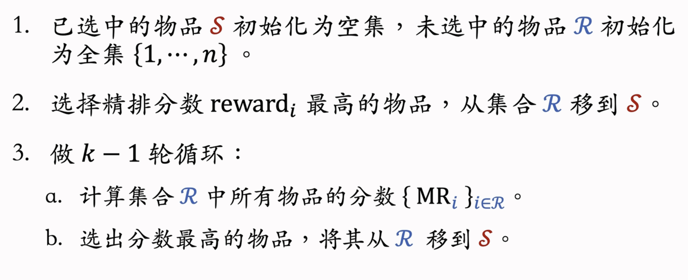

https://www.yuque.com/yuejiangliu/recommended-system-in-the-industry/overview

https://zhuanlan.zhihu.com/p/678664853

# 概要

- 北极星指标 —— 衡量推荐系统好坏 —— 在小红书考虑下面 3 个

  - 用户规模：

    - 日活用户数（DAU）、月活用户数（MAU）

    - DAU：每天使用 1 次以上

    - MAU：每月使用 1 次以上

- 消费：
  - 人均使用推荐的时长、人均阅读笔记的数量

- 发布：
  - 发布渗透率、人均发布量

- 北极星指标 都是线上指标，只能上线了才能获得

### 链路


- 粗排：用到规模比较小的模型
- 精排：用到大规模深度神经网络，对 items 进行打分
- 召回通道：协同过滤、双塔模型、关注的作者等等
  - 小红书有几十个召回通道，每个通道返回几十上百篇笔记
  - 将所有召回通道的内容融合后，会去重，并过滤（例如去掉用户不喜欢的作者的笔记，不喜欢的话题）

- 排序： 排序： [几千] → 粗排 → [几百] → 精排 → [几百] → 重排 → [几十]
  - 粗排模型小，速度快；精排用的模型大，计算量大，打分更可靠
  - 用粗排做筛选，再用精排  —— 平衡计算量和准确性
  - 本来是可以用精排分数排序后直接推荐的，但此时的结果还存在一些不足（例如 多样性）
  - 重排根据多样性随机抽样，还要用规则将相似的笔记打散，还得把广告插进去
    - 重排做多样性抽样（比如 MMR、DPP），从几百篇中选出几十篇（抽样依据：精排分数、多样性）
    - 用规则打散相似笔记（不能把内容过于相似的笔记，排在相邻的位置上，减少同质化）（插入广告、运营推广内容，根据生态要求调整排序（例如 不能同时出很多美女图片））


总结

* 首先召回，多条通道取回几千篇笔记
* 再粗排，小规模nn打分选出top几百的（和召回都是大漏斗）
* 精排，大规模nn打分
* 重排：多样性抽样，规则打散，插入广告运营笔记

## A/B test

实现了一种 GNN 召回通道，离线实验结果正向

做线上的小流量 A/B 测试，考察新的召回通道对线上指标的影响

模型中有一些参数，比如 GNN 的深度取值 \in\{1,2,3\} ，需要用 A/B 测试选取最优参数

### 随机分桶

- 分 b = 10 个桶，每个桶中有 10% 的用户
- 首先用哈希函数把用户 ID 映射成某个区间内的整数，然后把这些整数均匀随机分成 b 个桶
- 全部 n 位用户，分成 b 个桶，每个桶中有 \frac{n}{b} 位用户

- 计算每个桶的业务指标，比如 DAU、人均使用推荐的时长、点击率、等等
- 如果某个实验组指标显著优于对照组，则说明对应的策略有效，值得推全

### 分层实验

流量不够用怎么办？

- 信息流产品的公司有很多部门和团队，大家都需要做 A/B 测试

  - 推荐系统（召回、粗排、精排、重排）

  - 用户界面

  - 广告

- 如果把用户随机分成 10 组，1 组做对照，9 组做实验，那么只能同时做 9 组实验

分层实验

- 分层实验：召回、粗排、精排、重排、用户界面、广告......（例如 GNN 召回通道属于召回层）
- 同层互斥：GNN 实验占了召回层的 4 个桶，其他召回实验只能用剩余的 6 个桶
- 不同层正交：每一层独立随机对用户做分桶。每一层都可以独立用 100% 的用户做实验


- **召回层（Recall）**：把用户分成 10 个桶 $\mathcal{U}_1, ..., \mathcal{U}_{10}$
- **精排层（Ranking）**：把用户也分成 10 个桶 $\mathcal{V}_1, ..., \mathcal{V}_{10}$

假设系统共有 $n$ 个用户：
$$
|\mathcal{U}_i| = |\mathcal{V}_j| = n/10
$$
也就是说，每个桶的用户数量相等。

### 召回桶之间互斥

$$
\mathcal{U}_i \cap \mathcal{U}_j = \emptyset \quad (i \ne j)
$$

- 这意味着**同一个用户不会同时参与两个不同召回实验**。

召回桶和精排桶的交集

### 桶的交集

$$
|\mathcal{U}_i \cap \mathcal{V}_j| = n/100
$$

- 总用户数 $n$ 分成 10 个召回桶和 10 个精排桶，交集大小正好是 $n / (10 \times 10) = n/100$
- **解释**：
  - 一个用户不能同时受两个召回实验的影响，但可以同时受一个召回实验 + 一个精排实验的影响

### Holdout 机制

10% holdout 桶 vs 90% 实验桶的 diff（需要归一化）为整个部门的业务指标收益


holdout 桶里面不加任何新的实验，保持干净以便对照

每个考核周期结束之后，清除 holdout 桶，让推全实验从 90% 用户扩大到 100% 用户

```
整个用户群
├── Holdout (10%)：不参与实验，baseline
└── 实验用户 (90%)
     ├── 原有层（旧策略）
     └── 新推全层（正交）
           ├── 新策略大部分用户
           └── 反转桶（小部分用户，仍用旧策略）
```

# 召回

### ItemCF (Item Collaboration Filter)

维护两个索引：`user-> list<item> `, `item->topK similar item`


1. **余弦相似度**：

$$
sim(i,j) = \frac{|U_i \cap U_j|}{\sqrt{|U_i|\cdot |U_j|}}
$$

公式没有考虑喜欢的程度 𝑙𝑖𝑘𝑒(𝑢𝑠𝑒𝑟, 𝑖𝑡𝑒𝑚)，即喜欢就是 1，不喜欢就是 0

如果用户喜欢 A，那么他也可能喜欢与 A 相似的物品 B

1. 找出用户已经喜欢过的物品集合 $I_u$
2. 对每个已喜欢的物品 $i \in I_u$，找出最相似的物品集合
3. 计算推荐得分：

$$
score(u, j) = \sum_{i \in I_u} sim(i, j)
$$

4. 将得分最高的topK物品推荐给用户

事先做离线计算

建立“用户 → 物品”的索引

- 记录每个用户最近点击、交互过的物品 ID
- 给定任意用户 ID，可以找到他近期感兴趣的物品列表

建立“物品 → 物品”的索引

- 计算物品之间两两相似度
- 对于每个物品，索引它最相似的 k 个物品
- 给定任意物品 ID，可以快速找到它最相似的 k 个物品

线上做召回

1. 给定用户 ID，通过“用户 → 物品”索引，找到用户近期感兴趣的物品列表（last-n）
2. 对于 last-n 列表中每个物品，通过“物品 → 物品”的索引，找到 top-k 相似物品
3. 对于取回的相似物品（最多有 𝑛𝑘 个），用公式预估用户对物品的兴趣分数
4. 返回分数最高的 100 个物品，作为推荐结果

索引的意义在于避免枚举所有的物品。用索引，离线计算量大，线上计算量小

1. 记录用户最近感兴趣的 n=200 个物品
2. 取回每个物品最相似的 k=10 个物品
3. 给取回的 nk=2000 个物品打分（用户对物品的兴趣）
4. 返回分数最高的 100 个物品作为 ItemCF 通道的输出

### Swing

Swing 和 ItemCF 很像，唯一区别在于如何定义相似度

ItemCF的问题

- 下图中两篇笔记被碰巧分享到了一个微信群里面
- 造成问题：两篇笔记的受众完全不同，但很多用户同时交互过这两篇笔记，导致系统错误判断两篇笔记相似度很高

- 想要解决该问题，就要降低小圈子用户的权重
- 如果大量不相关的用户同时交互两个物品，则说明两个物品的受众真的相同

两个物品的相似度：$sim(i_1,i_2)=\sum_{u_1\in \mathcal{V}}\sum_{u_2\in \mathcal{V}}\frac{1}{α+overlap(u_1,u_2)}$

- α 是超参数
- $overlap(u_1,u_2)$ 表示两个用户的重合度

- 重合度高，说明两人是一个小圈子的，那么他两对物品相似度的贡献就比较小
- 重合度小，两人不是一个小圈子的，他两对物品相似度的贡献就比较大

ItemCF：两个物品重合的用户比例高，则判定两个物品相似

Swing：额外考虑重合的用户是否来自一个小圈子

- 同时喜欢两个物品的用户记作集合 \mathcal{V}
- 对于 \mathcal{V} 中的用户 u_1 和 u_2，重合度记作 overlap(u_1,u_2)
- 两个用户重合度大，则可能来自一个小圈子，权重降低

### UserCF

先找相似用户，再推荐他们喜欢的物品给目标用户

推荐系统如何找到跟我兴趣非常相似的网友呢？

- 方法一：点击、点赞、收藏、转发的笔记有很大的重合
- 方法二：关注的作者有很大的重合

预估用户对候选物品的兴趣：$\sum_jsim(user,user_j)×like(user_j,item)$

计算用户相似度

- 用户 u_1 喜欢的物品记作集合 \mathcal{J}_1
- 用户 u_2 喜欢的物品记作集合 \mathcal{J}_2
- 定义交集 I=\mathcal{J}_1\cap\mathcal{J}_2
- 两个用户的相似度：$sim(u_1,u_2)=\frac{|I|}{\sqrt{|\mathcal{J}_1|·|\mathcal{J}_2|}}$

越热门的物品，越无法反映用户独特的兴趣，对计算用户相似度越没有价值，降低热门物品权重

- $n_l$：喜欢物品 l 的用户数量，反映物品的热门程度
- 物品越热门，$\frac{1}{\log{(1+n_l)}}$ 越小，对相似度的贡献就越小

#### 事先做离线计算

建立“用户 → 物品”的索引

- 记录每个用户最近点击、交互过的物品 ID
- 给定任意用户 ID，可以找到他近期感兴趣的物品列表

建立“用户 → 用户”的索引

- 对于每个用户，索引他最相似的 k 个用户
- 给定任意用户 ID，可以快速找到他最相似的 k 个用户

线上做召回

1. 给定用户 ID，通过“用户 → 用户”索引，找到 top-k 相似用户
2. 对于每个 top-k 相似用户，通过“用户 → 物品”索引，找到用户近期感兴趣的物品列表（last-n）
3. 对于取回的 nk 个相似物品，用公式预估用户对每个物品的兴趣分数
4. 返回分数最高的 100 个物品，作为召回结果

### 离散特征处理

离散特征处理的步骤

- 建立字典：把类别映射成序号
- 向量化：把序号映射成向量
  - One-hot 编码：把序号映射成高维稀疏向量（向量中只有 0，1） (类别数量太大时，通常不用 one-hot 编码)
  - Embedding：把序号映射成低维稠密向量（向量中有小数）（参数以矩阵的形式保存，矩阵大小是 向量维度 × 类别数量）

### 矩阵补充

#### 训练

基本想法

- 用户 embedding 参数矩阵记作 $\bold{A}$。第 u 号用户对应矩阵第 u 列，记作向量 $\bold{a}_u$
- 物品 embedding 参数矩阵记作 $\bold{B}$。第 i 号物品对应矩阵第 i 列，记作向量 $\bold{b}_i$
- 内积$ \left\langle \bold{a}_u,\bold{b}_i \right\rangle$ 是第 u 号用户对第 i 号物品兴趣的预估值
- 训练模型的目的是学习矩阵 \bold{A} 和 \bold{B}，使得预估值拟合真实观测的兴趣分数

数据集

- 数据集：（用户 ID，物品 ID，真实兴趣分数）的集合，记作 $\Omega=\{(u,i,y) \}$

- 数据集中的兴趣分数是系统记录的，比如：

  - 曝光但是没有点击 → 0 分

  - 点击、点赞、收藏、转发 → 各算 1 分

  - 分数最低是 0，最高是 4

- 训练的目的就是让模型的输出拟合真实兴趣分数

训练

- 把用户 ID、物品 ID 映射成向量。

  - 第 u 号用户 → 向量 $\bold{a}_u$

  - 第 i 号物品 → 向量 $\bold{b}_i$


- 矩阵中只有少数位置是绿色，大多数位置是灰色（即大部分物品没有曝光给用户）
- 而我们用绿色位置训练出的模型，可以预估所有灰色位置的输出，即把矩阵的元素补全
- 把矩阵元素补全后，我们只需选出对应用户一行中分数较高的 物品 推荐给 用户 即可

缺点

- 仅用 ID embedding，没利用物品、用户属性

  - 物品属性：类目、关键词、地理位置、作者信息

  - 用户属性：性别、年龄、地理定位、感兴趣的类目

  - 双塔模型可以看做矩阵补充的升级版

  - 双塔模型不仅使用 ID，还结合各种属性

- 负样本的选取方式不对

  - 样本：用户—物品的二元组，记作 (u,i)
  - 正样本：曝光之后，有点击、交互。（正确的做法）
  - 负样本：曝光之后，没有点击、交互。（错误的做法）

  - 后面会专门用一节课时间讲正负样本如何选择

- 做训练的方法不好

  - 内积 $ \left\langle \bold{a}_u,\bold{b}_i \right\rangle$ 不如余弦相似度

  - 工业界普遍使用 余弦相似度 而不是 内积

  - 用平方损失（回归），不如用交叉熵损失（分类）

线上召回

- 把用户向量 \bold{a} 作为 query，查找使得  \left\langle \bold{a}_u,\bold{b}_i \right\rangle  最大化的物品 i
- 暴力枚举速度太慢。实践中用近似最近邻查找
- Milvus、Faiss、HnswLib 等向量数据库支持近似最近邻查找

### 双塔模型

**左塔（User Tower）**：输入用户的特征（用户ID、年龄、性别、历史行为序列、上下文信息等），输出用户的 embedding 向量 $\mathbf{u}$

**右塔（Item Tower）**：输入物品的特征（itemID、类目、价格、标题 embedding 等），输出物品的 embedding 向量 $\mathbf{v}$

通过内积或余弦相似度来衡量用户与物品的匹配程度：
$$
score(u, v) = \mathbf{u}^\top \mathbf{v}
$$


用户离散特征：例如所在城市、感兴趣的话题等

- 对每个离散特征，单独使用一个 Embedding 层得到一个向量
- 对于性别这种类别很少的离散特征，直接用 one-hot 编码

用户连续特征：年龄、活跃程度、消费金额等

- 双塔模型：左塔提取用户特征，右塔提取物品特征

- 与矩阵补充的区别在于，使用了除 ID 外的多种特征作为双塔的输入

#### 训练

- Pointwise：独立看待每个正样本、负样本，做简单的二元分类
- Pairwise：每次取一个正样本、一个负样本[1]
- Listwise：每次取一个正样本、多个负样本[2]

正负样本的选择

- 正样本：用户点击的物品

- 负样本[1, 2]：

  - 没有被召回的？

  - 召回但是被粗排、精排淘汰的？

  - 曝光但是未点击的？

  - 小红书选取负样本时，基本就参考了上面两篇论文[1, 2]

#### Pointwise 训练

- 把召回看做二元分类任务
- 对于正样本，鼓励 $\cos{(\bold{a},\bold{b})}$ 接近 +1
- 对于负样本，鼓励 $\cos{(\bold{a},\bold{b})}$$ 接近 −1
- 控制正负样本数量为 1: 2 或者 1: 3

#### Pairwise 训练

正样品，负样品都是相同nn参数的，cos(a,b+)大于 cos(a,b-)

- 如果  $\cos{(\bold{a},\bold{b}^+)}$ 大于 $\cos{(\bold{a},\bold{b}^-)}+m$，则没有损失

- m 是超参数，需要调

- 否则，损失等于  $\cos{(\bold{a},\bold{b}^-)}+m-\cos{(\bold{a},\bold{b}^+)}$

Triplet hinge loss:

$L(\bold{a},\bold{b}^+,\bold{b}^-)=\max{\{ 0,\cos{(\bold{a},\bold{b}^-)}+m-\cos{(\bold{a},\bold{b}^+)}\}}$

Triplet logistic loss:

- $L(\bold{a},\bold{b}^+,\bold{b}^-)=\log{( 1+\exp{[\sigma·(\cos{(\bold{a},\bold{b}^-)}-\cos{(\bold{a},\bold{b}^+))}])}}$

- $\sigma$ 是大于 0 的超参数，控制损失函数的形状，需手动设置

#### Listwise 训练

一条数据包含：

- 一个用户，特征向量记作 $\bold{a}$
- 一个正样本，特征向量记作$\bold{b}^+$
- 多个负样本，特征向量记作$\bold{b}^-_1,...,\bold{b}^-_n$

鼓励$\cos{(\bold{a},\bold{b}^+)}$ 尽量大

鼓励 $\cos{(\bold{a},\bold{b}^-_1)},...,\cos{(\bold{a},\bold{b}^-_n)}$ 尽量小


- 正样本 $y^+=1$，即鼓励 $s^+ $趋于 1
- 负样本 $y^-_1=...=y^-_n=0$，即鼓励 $s^-_1...s^-_n$ 趋于 0
- 用 y 和 s 的交叉熵作为损失函数，意思是鼓励 Softmax 的输出 s 接近标签 y

#### 不适用于召回的模型


用户和物品的向量在进入神经网络前就拼接起来了，和双塔模型有很大区别

- 双塔模型是在后期输出相似度时才进行融合
- 用户（或物品）自身特征的拼接没有影响，依然保持了用户（或物品）的独立性
- 而一旦用户和物品进行拼接，此时的输出就特定于该 用户（或物品）了

这种前期融合的模型，不适用于召回

- 因为得在召回前，把每个用户向量对应的所有物品向量挨个拼接了送入神经网络
- 假设有一亿个物品，每给用户做一次召回，就得跑一亿遍

这种模型通常用于排序，在几千个候选物品中选出几百个

以后看到这种模型就要意识到 —— **这是排序模型，不是召回模型**

#### 双塔模型：正负样本

暂略

#### 双塔模型：线上召回和更新

离线存储：把物品向量 b 存入向量数据库 线上召回：查找用户最感兴趣的k个物品

为什么事先存储物品向量 b, 线上现算用户向量a?

- 每做一次召回，用到一个用户向量 a, 几亿物品向量 b（线上算物品向量的代价过大）
- 用户兴趣动态变化，而物品特征相对稳定（可以离线存储用户向量，但不利于推荐效果）

#### 模型更新

全量更新 vs 增量更新：

全量更新：今天凌晨，用昨天全天的数据训练模型

- 在昨天模型参数的基础上做训练（不是重新随机初始化）
- 用昨天的数据，训练 1 epoch，即每天数据只用一遍
- 发布新的 用户塔神经网络 和 物品向量，供线上召回使用
- 全量更新对数据流、系统的要求比较低

增量更新：做 online learning 更新模型参数

- 用户兴趣会随时发生变化
- 实时收集线上数据，做流式处理，生成 TFRecord 文件
- 对模型做 online learning，增量更新 ID Embedding 参数（不更新神经网络其他部分的参数）

- 即锁住全连接层的参数，只更新 Embedding 层的参数，这是出于工程实现的考量

- 发布用户 ID Embedding，供用户塔在线上计算用户向量

全量更新：今天凌晨，用昨天的数据训练整个神经网络，做 1 epoch 的随机梯度下降

增量更新：用实时数据训练神经网络，只更新 ID Embedding，锁住全连接层

实际的系统：

- 全量更新 & 增量更新 相结合
- 每隔几十分钟，发布最新的用户 ID Embedding，供用户塔在线上计算用户向量

### 总结

双塔就是user embedding, item embedding -> get similarity score (cosine similarity)，计算相关度用在召回retrieval

如果直接concat 用在排序！

# 排序

对于每篇笔记，系统记录： 

- 曝光次数（number of impressions）

- 点击次数（number of clicks）

- 点赞次数（number of likes）

- 收藏次数（number of collects）

- 转发次数（number of shares）

 CTR click through rate 点击率 = 点击次数 / 曝光次数 

 like rate 点赞率 = 点赞次数 / 点击次数 

 收藏率 = 收藏次数 / 点击次数 

 转发率 = 转发次数 / 点击次数 

 排序的依据 

- 排序模型预估点击率、点赞率、收藏率、转发率等多种分数

- 融合这些预估分数（比如加权和）

- 根据融合的分数做排序、截断

### 多目标模型


- 统计特征包括"用户统计特征"和"物品统计特征"
- "场景特征" 是随着用户请求传过来的

P(行为| 用户特征, 物品特征, 上下文特征) 是条件概率预测问题


Cross Entropy 让预估值接近真实目标值

困难：类别不平衡，即正样本数量显著少于负样本 

> 如果直接用所有样本训练，模型可能只学会预测“负样本”，就能达到很低的 loss（但没用）。
>
> 举例：如果点击率 1%，模型学会永远输出 0（预测无点击），表面上准确率 99%，但实际没有价值。

- 每 100 次曝光，约有 10 次点击、90 次无点击

- 每 100 次点击，约有 10 次收藏、90 次无收藏

-  注：不是小红书的真实数据

 解决方案：负样本降采样（down-sampling） 

- 保留一小部分负样本

- 让正负样本数量平衡，节约计算量

### 预估值校准

做了降采样后训练出的预估点击率会大于真实点击率。

-  正样本、负样本数量为  和 

-  对负样本做降采样，抛弃一部分负样本 

-  使用  个负样本， 是采样率 

-  由于负样本变少，预估点击率大于真实点击率 

### Multi-gate Mixture-of-Experts (MMoE)

- 三个神经网络结构相同，但是不共享参数 （不同角度提取特征的专门子网络）

- 专家神经网络的数量是超参数，实践中通常用 4 个或 8 个


### 极化现象（Polarization）

专家神经网络在实践中的问题。


解决极化问题 

-  如果有 n 个“专家”，那么每个 softmax 的输入和输出都是 n 维向量 

-  在训练时，对 softmax 的输出使用 **dropout** 

-  Softmax 输出的 n 个数值被 mask 的概率都是 10% 

-  每个“专家”被随机丢弃的概率都是 10% 
  - 由于每个“专家”都可能被丢弃，神经网络就会尽量避免极化的发生

### 预估分数的融合

略，有具体的融合公式

### 视频

图文笔记排序的主要依据：点击、点赞、收藏、转发、评论...... 

视频排序的依据还有播放时长和完播 

- 对于视频来说，播放时长与完播的重要性大于点击
- 回归拟合播放时长效果不好，YouTube 的时长建模？

### 精排 vs 粗排

**前期融合**：先对所有特征做 concatenation，再输入神经网络 

- 这个网络叫 shared bottom，意思是它被多个任务共享

-  线上推理代价大：如果有 n 篇候选笔记，整个大模型要做 n 次推理 

双塔模型（一种粗排模型）

-  **后期融合**：把用户、物品特征分别输入不同的神经网络，不对用户、物品特征做融合 

-  线上计算量小： 

  - 用户塔只需要做一次线上推理，计算用户表征 a

  - 物品表征 b 事先储存在向量数据库中，物品塔在线上不做推理

-  后期融合模型不如前期融合模型准确 

  - 预估准确性不如精排模型

  - 后期融合模型用于召回，前期融合模型用于精排

小红书粗排用的三塔模型，效果介于双塔和精排之间

- 三塔模型在塔输出的位置做融合


#### 双塔（Two-Tower）复盘

- 用户塔 → 输出 user embedding
- 物品塔 → 输出 item embedding
- 相似度计算 → dot/cosine → 得分

如果只做 **向量相似度**：

- 用户 embedding 可以缓存
- 物品 embedding 也可以缓存
- 计算量很低

**缺点**：

- 只能做简单的 embedding 匹配
- 想加入复杂交叉特征（比如用户最近行为与物品标签交互、统计特征等）时：
  - 双塔没办法提前算好，需要对每个 user-item pair 全量做一次额外计算
  - 这部分计算量在粗排阶段很大

#### 三塔（Three-Tower）的思路

**下层**（**缓存可复用**）

- 用户塔 → user embedding
- 物品塔 → item embedding

**上层**（每个候选做一次）

- 交叉塔 → user embedding + item embedding + 交叉特征 → 得分

### 

双塔原本设计是 **用户 embedding × 物品 embedding → dot/cosine**

如果你想加 **复杂交叉特征**（比如用户历史行为和物品属性的组合特征）：

- 交叉特征需要依赖 **原始特征和 embedding**
- **embedding 是基于原始特征生成的**，而双塔没设计缓存交叉特征的机制
- 所以每个 user-item pair 都要重新生成 embedding + 计算交叉 → **重复计算量大**

三塔把 embedding 生成拆成 **下层 embedding + 上层交叉塔**

**下层 embedding**：

- 用户塔 embedding：每个用户算一次
- 物品塔 embedding：大部分热门物品可以缓存

**上层交叉塔**：

- 直接拿下层 embedding + 交叉特征做轻量 concat → 打分
- 不必重新生成 embedding → 节省大量重复计算

# 特征交叉 20250925

### Factorized Machine (FM)

#### 线性模型

d个特征，模型d+1参数，其中1是b，bias，w有d个

#### 二阶交叉特征 

d个特征，线性+二阶交叉特征，参数个数O(d^2)

d 较大时，参数数量过多，且容易出现过拟合


k<<d，是一个超参数

Factorized Machine (FM): p=b+wx+vivj xixj

参数有 O(kd)个，k<<d

### 深度交叉网络（DCN）

具体看视视频，很详细
https://www.bilibili.com/video/BV1HZ421U77y/?spm_id_from=333.337.search-card.all.click&vd_source=a497e92c59f6f0157246d6c709696d67

截止 4:40

# 行为序列

### LastN

- LastN：用户最近的 n 次交互（点击、点赞等）的物品 ID
- 对 LastN 物品 ID 做 embedding，得到 n 个向量
- 把 n 个向量取平均，作为用户的一种特征
- 适用于召回双塔模型、粗排三塔模型、精排模型


- 上面得到的多个向量拼接起来，作为一种用户特征，传到召回或排序模型中
- Embedding 不只有物品 ID，还会有物品类别等特征

### DIN模型

- DIN 用加权平均代替平均，即注意力机制（attention）
- 权重：候选物品与用户 LastN 物品的相似度


- 候选物品：例如粗排选出了 500 个物品，那这 500 个就是精排的候选物品

- 计算相似度的方法很多，如 内积 和 余弦相似度 等

- DIN 模型总结

  - 对于某候选物品，计算它与用户 LastN 物品的相似度

  - 以相似度为权重，求用户 LastN 物品向量的加权和，结果是一个向量

  - 把得到的向量作为一种用户特征，输入排序模型，预估（用户，候选物品）的点击率、点赞率等指标

  - 本质是注意力机制（attention）


简单平均 vs. 注意力机制

- 简单平均 和 注意力机制 都适用于精排模型

- 简单平均适用于双塔模型、三塔模型

  - 简单平均只需要用到 LastN，属于用户自身的特征，与候选物品无关

  - 把 LastN 向量的平均作为用户塔的输入

- 注意力机制不适用于双塔模型、三塔模型

  - 注意力机制 需要用到 LastN + 候选物品

  - 用户塔看不到候选物品，不能把 注意力机制 用在用户塔

### SIM 模型

SIM 模型的主要目的是保留用户的长期兴趣。

DIN 模型 

- 计算用户 LastN 向量的加权平均
- 权重是候选物品与 LastN 物品的相似度

 DIN 模型的缺点 

-  注意力层的计算量  正比于n（用户行为序列的长度） 
-  只能记录最近几百个物品，否则计算量太大 
-  缺点：关注短期兴趣，遗忘长期兴趣 

如何改进 DIN？ 

-  目标：保留用户长期行为序列（n  很大），而且计算量不会过大 

 改进 DIN： 

- DIN 对 LastN 向量做加权平均，权重是相似度
- 如果某 LastN 物品与候选物品差异很大，则权重接近零
- 快速排除掉与候选物品无关的 LastN 物品，降低注意力层的计算量

 SIM 模型 

- 保留用户长期行为记录，n 的大小可以是几千
- 对于每个候选物品，在用户 LastN 记录中做快速查找，找到 k 个相似物品
- 把 LastN 变成 TopK，然后输入到注意力层
- SIM 模型减小计算量（从 n 降到 k)

#### 第一步：查找

 方法一：Hard Search —— 根据规则做筛选 

- 根据候选物品的类目，保留 LastN 物品中类目相同的
- 简单，快速，无需训练

 方法二：Soft Search 

- 把物品做 embedding，变成向量
- 把候选物品向量作为 query，做 k 近邻查找，保留 LastN 物品中最接近的 k 个
- 效果更好，编程实现更复杂

### 第二步：注意力机制

Trick：使用时间信息

-  用户与某个 LastN 物品的交互时刻距今为 $\delta$) 
-  对  $\delta$  做离散化，再做 embedding，变成向量 d 
  - 例如把时间离散为 1 天内、7 天内、30 天内、一年、一年以上

* 把两个向量做 concatenation，表征一个 LastN 物品 

  - 向量 x 是物品 embedding

  - 向量 d 是时间的 embedding


为什么 SIM 使用时间信息？

- DIN 的序列短，记录用户近期行为
- SIM 的序列长，记录用户长期行为
- 时间越久远，重要性越低

### 结论

- 长序列（长期兴趣）优于短序列（近期兴趣）
- 注意力机制优于简单平均
- Soft search 还是 hard search？取决于工程基建
- 使用时间信息有提升

# 重排

### 物品相似性的度量

 相似性的度量 

-  基于物品属性标签 

- 类目、品牌、关键词......

 基于物品向量表征 

- 用召回的双塔模型学到的物品向量（不好）
- 基于内容的向量表征（好）

推荐系统的头部效应明显，新物品 和 长尾物品 的曝光少

双塔模型学不好 新物品 和 长尾物品 的向量表征


基于图文内容的物品向量表征 （也就是如何训练CNN？使用CLIP）

- CLIP 是当前公认最有效的预训练方法
- 思想： 对于 图片—文本 二元组，预测图文是否匹配
- 优势：无需人工标注。小红书的笔记天然包含图片 + 文字，大部分笔记图文相关
- 做预训练时：同一篇笔记的 图文 作为正样本，它们的向量应该高度相似；来自不同笔记的图文作为负样本


有m个正样本， m*(m-1)个负样本

### 提升多样性的方法


- 粗排和精排用多目标模型对物品做 pointwise 打分，就打分，不考虑物品间的关联

-  对于物品 i，模型输出点击率、交互率的预估，融合成分数 reward_i 
-  reward_i 表示用户对物品 i 的兴趣，即物品本身价值 

粗排 i 几千，精排 i 几百

后处理主要作用：集成多样性？

给定 n 个候选物品，排序模型打分 reward_1 ...reward_n,

后处理：从n 个候选物品中选出 k 个，既要它们的总分高，也需要它们有**多样性** 

- **精排的后处理通常被称为 —— 重排**
- 增加多样性可以显著提升推荐系统指标（尤其是时长、留存率）


### Maximal Marginal Relevance (MMR)

融合之后的分数reward_i (精排分数)

相关性 sim(i,j) 多样性分数


Marginal Relevance 分数： 
$$
\mathrm{MR}_i=\theta \cdot \operatorname{reward}_i-(1-\theta) \cdot \max _{j \in \mathcal{S}} \operatorname{sim}(i, j)
$$
Maximal Marginal Relevance (MMR)：$argmax_{i<R}MR_i$



- 缺点：已选中的物品越多（即集合 S 越大），越难找出物品 i in R，使得 i 与 S 中的物品都不相似
- 集合S越大，可供选择/已选择的物品j越多，我们的目标是最大化MMR，就要使sim(i,j)尽量小，但由于物品j的数量很多，很容易就能选到和i相似度大的物品，不利于最大化MMR

### 滑动窗口

解决方案：设置一个滑动窗口 W ，比如最近选中的 10 个物品，用 W 代替 MMR 公式中的 S


$$
\begin{aligned}
& \operatorname{argmax}_{i \in \mathcal{R}}\left\{\theta \cdot \operatorname{reward}_i-(1-\theta) \cdot \max _{j \in \mathcal{S}} \operatorname{sim}(i, j)\right\} \\
& \operatorname{argmax}_{i \in \mathcal{R}}\left\{\theta \cdot \operatorname{reward}_i-(1-\theta) \cdot \max _{j \in \mathcal{W}} \operatorname{sim}(i, j)\right\}
\end{aligned}
$$

- 用滑动窗口的可解释性：给用户曝光的连续物品应该不相似，但没必要最新的物品和 30 个之前的物品还不相似

### 总结

- MMR 使用在精排的后处理（重排）阶段
- 根据精排分数和多样性分数给候选物品排序
- MMR 决定了物品的最终曝光顺序
- 实际应用中通常带滑动窗口，这样比标准 MMR 效果更好

### 重排的规则

- 工业界的推荐系统一般有很多业务规则，这些规则通常是为了保护用户体验，做重排时这些规则必须被满足
- 下面举例重排中的部分规则，以及这些规则与 MMR 相结合
- 规则的优先级高于多样性算法

#### MMR + 重排规则

- 重排结合 MMR 与规则，在满足规则的前提下最大化 MR
- 每一轮先用规则排除掉 R  中的部分物品，得到子集 R' 
- MMR 公式中的 R 替换成子集 R'，选中的物品符合规则

### DPP：数学基础 DPP 是目前推荐系统重排多样性公认的最好方法 

超平形体 数学定义 
$$
\mathcal{P}\left(v_1, \cdots, v_k\right)=\left\{\alpha_1 v_1+\cdots+\alpha_k v_k \mid 0 \leq \alpha_1, \cdots, \alpha_k \leq 1\right\}
$$
v1, v2, ...  vk 必须线性无关


- 如果 v1, v2, ...  vk 两两正交（多样性好），则体积最大化，vol=1
- 如果 v1, v2, ...  vk 线性相关（多样性差），则体积最小化，vol=0


行列式与体积满足 $det(V^TV)=vol(P(v1,v2...vk))^2$

- 即行列式和体积是等价的
- 因此，可以用行列式 $det(V^TV)$ 衡量 $v1,v2...vk$ 多样性

### 多样性

n 个物品中选出 k 个物品，组成集合 S

* 价值大：分数之和 $\Sigma reward_j$ 越大越好
* 多样性好：S中k个向量组成的超平形体 P(S)的体积越大越好

### 行列式点过程（DPP）

DPP 是一种传统的统计机器学习方法
$$
\operatorname{argmax}_{\mathcal{S}:|\mathcal{S}|=k} \log \operatorname{det}\left(V_{\mathcal{S}}^T V_{\mathcal{S}}\right)
$$

- 从集合 S 中选出 k 个
- 该公式严格来说叫 k-DPP

Hulu：
$$
\arg \max _{\mathcal{S}:|\mathcal{S}|=k} \theta \cdot\left(\sum_{j \in \mathcal{S}} \operatorname{rreward}_j\right)+(1-\theta) \cdot \log \operatorname{det}\left(V_{\mathcal{S}}^T V_{\mathcal{S}}\right) .
$$

- 前半部分计算集合中物品的价值
- 后半部分是行列式的对数，物品多样性越好，这部分越大
- Hulu 论文的主要贡献不是提出该公式，而是快速求解该公式

设 $A$ 为 $n \times n$ 的矩阵，它的 $(i, j)$ 元素为 $a_{i j}=v_i^T v_j$

给定向量 $v_1, \cdots, v_n \in \mathbb{R}^d$ ，需要 $O\left(n^2 d\right)$ 时间计算 A 

$A \mathcal{S}=V \mathcal{S}^T, V_{\mathcal{S}}$ 为 $A$ 的一个 $k \times k$ 子矩阵。如果 $i, j \in \mathcal{S}$ ，则 $a_{i j}$ 是 $A_{\mathcal{S}}$ 的一个元素

DPP是一个组合优化的问题，从集合 {1,..n}中选出一个大小为k的子集s，精确 DPP 是不可能的，因为它是个 NP-hard 问题

### 贪心算法求解

$$
\operatorname{argmax}_{i \in \mathcal{R}} \theta \cdot \operatorname{reward}_i+(1-\theta) \cdot \log \operatorname{det}\left(A_{\mathcal{S} \cup\{i\}}\right)
$$

每一轮选择一个物品i，S已选中，R未选中，要求有较高reward，同时不能和选中物品相似

### 求解

Cholesky分解As=LL^T

初始时 $\mathcal{S}$ 中只有一个物品，$A_{\mathcal{S}}$ 是 $1 \times 1$ 的矩阵

每一轮循环，基于上一轮算出的 $A_{\mathcal{S}}=L L^T$ ，快速求出 $A_{\mathcal{S} \cup\{i\}}$ 的 Cholesky 分解 $(\forall i \in \mathcal{R})$ ，从而求出 $\log \operatorname{det}\left(A_{\mathcal{S} \cup\{i\}}\right)$

### 滑动窗口

- 随着集合 S 增大，其中相似物品越来越多，物品向量会趋近线性相关
- 导致行列式 det(As) 会坍缩到零，对数趋于负无穷


贪心算法每轮从 $\mathcal{R}$ 中选出一个物品：$\quad \operatorname{argmax}_{i \in \mathcal{R}} \theta \cdot \operatorname{reward}_i+(1-\theta) \cdot \log \operatorname{det}\left(A_{\mathcal{W} \cup\{i\}}\right)$

有很多规则约束，例如最多连续出 5 篇视频笔记（如果已经连续出了 5 篇视频笔记，下一篇必须是图文笔记）

用规则排除掉 $\mathcal{R}$ 中的部分物品，得到子集 $\mathcal{R}^{\prime}$ ，然后求解： $\operatorname{argmax}_{\mathrm{i} \in \mathcal{R}^{\prime}} \theta \cdot \operatorname{reward}_i+(1-\theta) \cdot \log \operatorname{det}\left(A_{\mathcal{W} \cup\{i\}}\right)$

# 损失函数

MSE Mean Squared Error

用于回归任务，衡量预测值和真实值之间的距离，让预测数值接近真实数值

Cross Entropy 衡量两个分布的差异，分类？

真实标签是分布 $p$，模型预测是分布 $q$

$H(p,q)=−∑_ip(i)logq(i)$

真实标签y，预测$\hat{y}$

# Dropout

### 防止过拟合

随机丢弃神经元，让网络不依赖某些特定特征。

每次训练都是 **子网络训练**，相当于训练了很多不同的网络，然后在测试时集成它们的效果。

类似 ensemble 的效果，但只需训练一次。

### 减少神经元间共适应（co-adaptation）

某些神经元可能互相依赖，导致网络容易过拟合训练数据。

Dropout 打破了这种依赖，促使神经元学习**更鲁棒、独立的特征**。

### 提高泛化能力

由于网络在每次迭代都面对随机子网络，训练出的特征更具泛化性，对测试集更稳健。